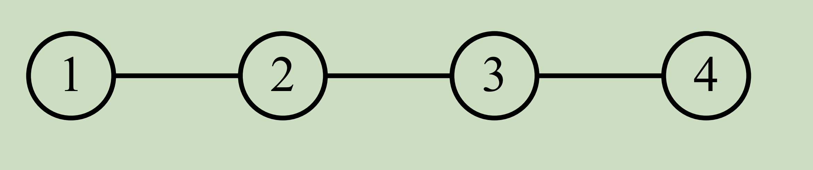
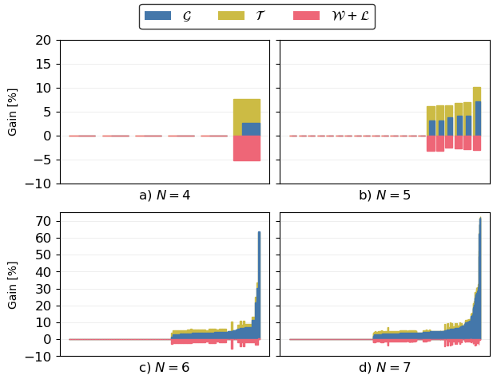
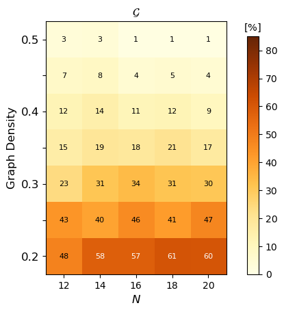
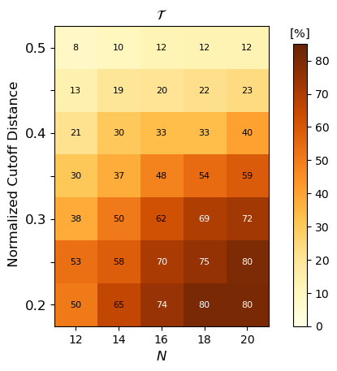

# Abstract

... This work focuses on achieving optimal AoI in all-to-all status update networks under the general topologically-dependent interference. In our model, each node serves as both a periodic source and a monitor, and multiple nodes can transmit simultaneously if they do not have a common neighbor.....

.... As far as we know, this is the first work to offer explicit AoI-oriented scheduling for all-to-all multi-hop under general interference constraints. The AoI-optimal schedule is transformed into a full graph-traversal problem.....

... We analyze the potential gains of supporting simultaneous transmission under interference constraints. For small networks, an additional dissemination delay incurred in the schedule is outweighed by a better update cycle, yielding an AoI improvement of \(6.83\%\). In AOHF, we combine simultaneous transmissions with network coding to improve AoI further. For large-scale networks, extensive evaluations demonstrate the effectiveness of AOHF and highlight AoI improvements. ...

# An Example



The AoI-optimal systematic schedule is given by (1, 1), (2, 1), (3, 1), (2, 2), (3, 2), (3, 3), (2, 3), (4, 4), (3, 4), (2, 4).  The topologically-dependent interference-constrained AoI-optimal schedule is ((1, 1), (4, 1)), (2, 1), (3, 4), (2, 4), (3, 1), (3, 3), (2, 3), (2, 2), (3, 2), with nodes $1$ and $4$ transmitting simultaneously at the first slot. 

The components $(\bar{\Delta},\tau,\omega+\gamma)$ are $(6.67, 5, 1.67)$ for the systematic and $(6.5, 4.5, 2.0)$ for the interference-constrained schedule.

**Despite the additional dissemination delay (dissemination delay $\omega+\gamma$), simultaneous transmissions lead to an AoI (average age of information for all to all status update $\bar{\Delta}$)  gain because of the reduction in the updating cycle ($2\tau$).**

Any references to this code, protocol, or results shall be realized by citing the original paper from IEEE Xplore.

## Preface
Our work is based on the A* method of https://ieeexplore.ieee.org/document/10279069

The original code repository for the scientific publication is 'Optimizing Age of Information in Status Update Systems using Network Coding: A Graph Search Approach' by Fisser, Leonard and Timm-Giel, Andreas published at the IEEE International Conference on Communications 2023 held in Rome, Italy.

The modified file is mainly in state_utilities_src_inf_v3.jl and incremental_a_star_inf_v3.jl

After the paper is accepted, we will disclose all the project codes.

## Getting Started
1. Download and install [JuliaLang](https://julialang.org/downloads/oldreleases/) Version 1.7.3.
2. Clone the repository to your local computer.
3. Start JuliaLang and navigate to the project's root directory.
4. Install project dependencies using:
```julia
pkg> activate .
pkg> instantiate
```

```julia
# 动作的数据结构
single_type_and_action = Dict(
    "action_type" => "single",
    "action" => single_action,
)
sim_type_and_action = Dict(
    "action_type" => "sim",
    "action" => sim_action,
    # "sim_tx_number" => length(sim_action),
)
# 负载的数据结构
payload_dict = Dict(
    "payload_type" => "single",
    "tx" => action[1],
    "payload" => payload,
)
payload_dict = Dict(
    "payload_type" => "sim",
    "tx_list" => tx_list,
    "payload_sim" => payload_s,
)

# 进一步将Key简化为
# "action_type" "at"
# "action" "a"
# "payload_type" "pt"
# "payload" ""payload_sim" "p"
# "tx” "tx_list"  "t"

# 邻居的数据结构 在利用邻居信息的时候可能用到
UpdateNeibors_all_simu_dict_temp = Dict(
    "neighbor_type" => "single",
    "UpdateNeibors" => UpdateNeibors,
)
UpdateNeibors_all_simu_dict_temp = Dict(
    "neighbor_type" => "sim",
    "UpdateNeibors" => UpdateNeibors_all_simu,
)
```


 [fig.four_line.pdf](git_figure\fig.four_line.pdf) 








